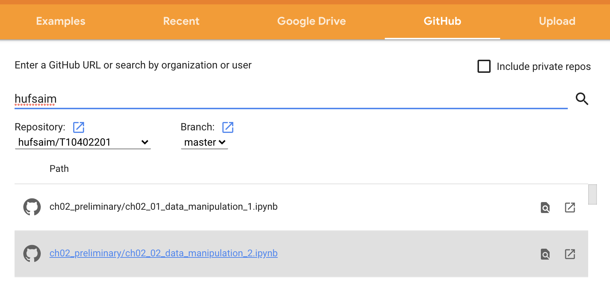

# T10402201
한국외국어대학교 바이오메디컬공학부 2020년 1학기 바이오메디컬인공지능 수업의 실습자료입니다. 

실습자료는 아래의 교재의 내용을 PyTorch에서 실습해 볼 수 있습니다.

- [http://d2l.ai/](http://d2l.ai/)

PyTorch 코드는 아래의 github repository의 내용을 참고하였습니다. 

- [https://github.com/dsgiitr/d2l-pytorch](https://github.com/dsgiitr/d2l-pytorch)

## Google Colab을 이용해 실습 진행하기
Google Colab을 이용해 편하게 실습을 진행할 수 있습니다. 본인의 구글계정에서 colab을 사용할 준비가 된 경우 아래의 링크를 클릭합니다.
- [https://colab.research.google.com/github/](https://colab.research.google.com/github/)

- GitHub에서 hufsaim을 검색한 후, hufsaim/T10402101을 선택하면 실습파일들이 나열됩니다.

- 실습할 파일을 선택하면 google colab에서 노트북파일을 열어 실습을 진행할 수 있습니다. 실습을 변경한 것은 github 저장소에 반영되지 않습니다. 

- 변경하거나 실행한 내용을 저장하고자 할 때에는 드라이브로 복사를 누르면 본인의 구글드라이브에 작업중인 노트북을 저장할 수 있습니다. Colab Notebooks폴더에 다음과 같이 저장될 것입니다.
